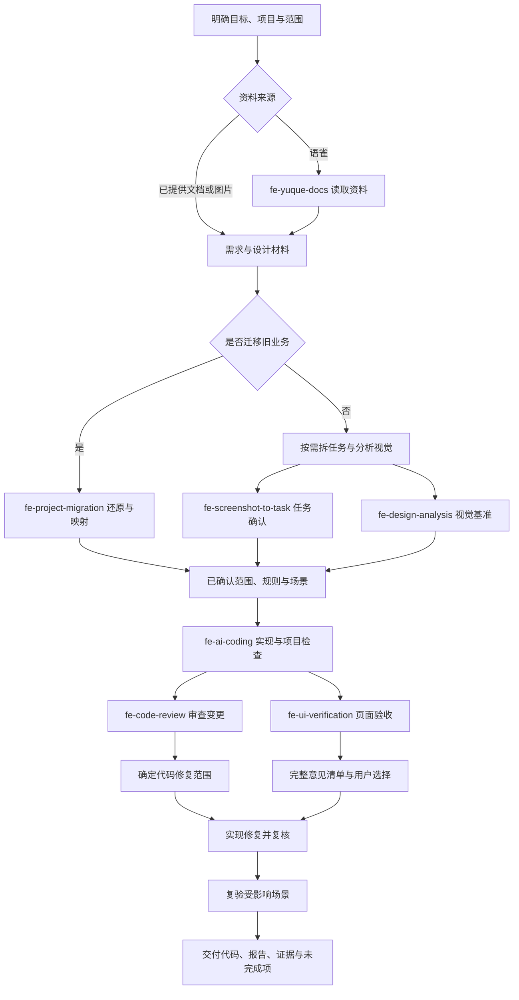

# 前端 Agent 工作流使用指南

本文介绍 fe-skills 中全部 7 个技能的职责、调用方式、交付结果和搭配方法，帮助团队用 Agent 完成需求理解、设计分析、开发、迁移、审查和验收。

技能负责约束某一类工作，Agent 负责结合用户目标与项目事实执行。完整工作流按任务需要选择阶段：明确的小改动直接开发和验证；涉及产品流程、视觉还原或跨项目迁移时，再加载对应技能。

> 本文依据仓库当前 `SKILL.md` 编写。具体执行细则以各技能文件和目标项目适用规则为准。文中的 `/path/project`、页面 URL、模块名均为示例，使用时替换为实际信息。

## 1. 安装与调用

### 1.1 安装

团队推荐使用 zero-tui：

```bash
npm install --global zero-tui && zero
```

进入 zero 后执行：

```text
/skill add zeroanonx/fe-skills
/skill update all
```

也可以使用 Skills CLI 安装：

```bash
npx skills add zeroanonx/fe-skills --all -g -a cursor -a codex -y
```

安装或更新后重新开启 Agent 会话。更多安装说明见[仓库 README](../README.md)。

### 1.2 调用

本文示例统一使用 `/fe-*` 表达技能调用；Codex 可使用 `$fe-*`。不同客户端的选择入口可能不同，以当前客户端可用技能为准。

```text
/fe-ai-coding 根据已确认的订单任务文档实现页面
$fe-ai-coding 根据已确认的订单任务文档实现页面
```

自然语言也可以说明目标，但 `fe-yuque-docs`、`fe-screenshot-to-task`、`fe-code-review` 当前声明了 `disable-model-invocation: true`，建议明确选择或点名调用，不依赖 Agent 自动加载。

调用时尽量提供目标、项目位置、范围和参照材料。上下文已明确的信息无需反复提供；换会话后应带上任务文件、报告或交接快照。

## 2. 技能总览

| 技能 | 解决的问题 | 主要输入 | 主要产出 |
| --- | --- | --- | --- |
| [fe-yuque-docs](../skills/fe-yuque-docs/SKILL.md) | 从语雀读取需求、规范和历史资料 | 文档/知识库 URL、搜索词 | 带来源链接的摘要、搜索结果或目录 |
| [fe-screenshot-to-task](../skills/fe-screenshot-to-task/SKILL.md) | 把截图、PRD 和交互描述变成前端任务 | 图片、产品说明、项目与路由信息 | 经确认的 `docs.md` 与截图归档 |
| [fe-design-analysis](../skills/fe-design-analysis/SKILL.md) | 提取开发与验收共用的视觉基准 | Figma、Pencil `.pen`、截图或标注 | `analysis.html`、`analysis.md` 与设计证据 |
| [fe-ai-coding](../skills/fe-ai-coding/SKILL.md) | 按目标项目约定写代码或生成项目 AI 规则 | 已确认任务、项目源码、适用约束 | 代码与校验结果；按需生成项目规则 |
| [fe-project-migration](../skills/fe-project-migration/SKILL.md) | 将旧前端业务迁入新工程 | 旧新项目、业务目标、参照版本与约束 | 迁移地图、规格、报告；执行模式下的代码 |
| [fe-code-review](../skills/fe-code-review/SKILL.md) | 审查本次 diff 的风险和质量 | 明确的变更范围、项目规则及规格 | HTML/MD 审查报告、P0/P1 易错模式归档 |
| [fe-ui-verification](../skills/fe-ui-verification/SKILL.md) | 将实际页面与设计对照验收 | 运行 URL、设计基准、视口与页面状态 | HTML/MD 差异报告、修改意见与复验记录 |

`fe-create-rules` 已合并到 `fe-ai-coding` 的规则生成模式，当前仓库不再单独提供该技能。生成规则与普通编码是两种用法，不要求每次开发都改项目规则。

## 3. 每个技能怎么用

### 3.1 fe-yuque-docs：获取需求和规范

用于读取私有语雀文档、搜索知识库、列目录和查看元信息。所有访问经技能中的 `scripts/yuque.py` 完成，使用本地 Cookie 认证；不通过其他 MCP 或手动 API 取代这条链路。

```text
/fe-yuque-docs 读取这份需求：https://example.yuque.com/group/book/doc
总结目标、页面、角色、关键交互、已明确约束和待确认项，保留来源链接。

/fe-yuque-docs 在这个知识库搜索“订单权限”，列出标题、摘要与完整链接。
知识库：https://example.yuque.com/group/book
```

默认交付结构化摘要，不复制全文。认证不可用时按技能指引配置或更新 Cookie；凭证不进入任务文件、报告或 Git。

**如何衔接：** 将摘要与原始链接提供给任务拆解、编码或迁移技能。文字需求已经足够明确时可以直接编码；不要为了使用截图技能制造不存在的图片输入。语雀技能只读，后续文档写在目标项目，不回写语雀。

### 3.2 fe-screenshot-to-task：明确业务与开发任务

用于回答“做什么、怎么做、从哪里到哪里、新建什么、点什么出什么”，把截图和产品说明转为可执行的前端任务。任务覆盖页面、组件、路由、交互、校验和权限；后端/API 设计、测试与部署方案不作为独立章节，范围外内容按该技能模板记录。

```text
/fe-screenshot-to-task 根据附件和这份 PRD，为 /path/project 拆解订单管理任务。
订单列表改造现有 /orders 路由，新增详情页的路由与菜单位置待确认。
请先展示业务理解、页面清单、交互和任务摘要，确认后生成文档。
```

执行顺序：归档图片 → 理解产品五问 → 澄清歧义与路由 → 准备任务摘要 → 用户确认 → 写入文档。新建/改造及路由信息不能由 Agent 自行猜测；已提供的明确信息沿用。

```text
fe-spec/tasks/{中文任务名称}/
├── docs.md
└── screenshot/
```

**如何衔接：** 将已确认的 `docs.md` 交给编码技能。它负责产品流程和任务边界，视觉数值与区域规格由设计分析补充。任务准备阶段可以扫描源码映射文件，但不会因此开始开发。

### 3.3 fe-design-analysis：建立视觉基准

用于分析设计稿的布局、文字、图片、层级、样式与已提供状态。按从上到下、从左到右、从外到里的顺序建立区域索引，映射项目已有 token、组件与素材。

```text
/fe-design-analysis 分析这份设计的订单列表与详情画板，目标端为桌面 Web。
目标项目：/path/project
重点提取区域关系、文字层级、间距、表格、弹窗、素材和已有状态。
截图估算值与节点实测值分开记录，缺失状态列为待确认。
```

```text
fe-spec/design-analysis/{模块}/{run-id}/
├── analysis.html
├── analysis.md
└── screenshot/
```

HTML 与 Markdown 内容一致，交付时主动打开 HTML 并检查渲染。只有截图时不编造精确字体、色值、断点、交互或 DOM 层级；视觉分组只是设计证据，具体实现仍按项目决定。

**如何衔接：** 开发引用 `analysis.md` 的区域与规格，UI 验收同时引用它和原始设计。分析报告不是设计稿的替代来源，也不能证明实现已通过验收。

### 3.4 fe-ai-coding：按项目规范实现

用于前端页面、组件、请求、状态、样式和注释修改。先检查项目规则、配置、已有改动及同类文件，再按实际约定组织代码，不擅自全库重构或套用新工程结构。

```text
/fe-ai-coding 在 /path/project 实现已确认的订单列表任务。
任务文档：fe-spec/tasks/订单管理/docs.md
视觉基准：fe-spec/design-analysis/订单列表/{run-id}/analysis.md
沿用现有路由、请求封装、权限、组件与主题，不修改范围外模块。
完成后执行相关项目检查，说明实际结果与未验证项。
```

规则优先级：用户明确要求与适用项目指令 → Lint/Formatter/TypeScript/构建配置 → 同业务现有写法 → 技能默认约定。文件、命名、类型、API、状态、样式等细则按场景加载。

新建 Vue 项目或明确采用团队结构时，使用技能的[最小项目分层](../skills/fe-ai-coding/rules/project-structure.md)。全局通用资源进入 assets/components；constants、hooks、shared/utils、stores、types 按 modules 与 index 组织；页面进入 PascalCase 的 views 目录。现有项目优先保持真实约定，不批量搬目录或创建空文件。

**规则生成模式：** 如果希望长期约束 Agent，可以先执行：

```text
/fe-ai-coding 只分析 /path/project 的目录、框架、配置和同类实现。
基于真实项目事实生成或合并 AGENTS.md，保留现有有效规则，不修改业务代码。
```

可生成 Cursor `.mdc`、Codex `AGENTS.md` 或 Claude `CLAUDE.md`。完成规则生成后交付规则；只有同时要求开发时才继续编码。

**如何衔接：** 使用任务文档决定业务范围，使用设计分析确定视觉目标，使用项目规则决定工程实现。代码交付后，按需要进入 CR 与实际页面验收。

### 3.5 fe-project-migration：承接旧业务

用于跨项目、跨技术栈的前端业务迁移。核心是还原完整操作链路、保留已确认契约并融入目标工程，不只是转换框架语法。

三种调用目标应区分清楚：

```text
/fe-project-migration 只读梳理 /path/legacy 的订单业务，对照 /path/target 输出业务地图和缺口。

/fe-project-migration 为两个项目的订单迁移制定方案和批次，暂不修改业务代码。

/fe-project-migration 将 /path/legacy 的订单链路迁到 /path/target。
保留已确认的参数、角色、状态和返回语义，按目标项目规范实现并验收。
允许修改范围：订单页面、业务 API 与必要路由；其他变更需先说明影响。
```

执行流程严格为：阶段 0 建立可复核基线 → 阶段 1 把老代码读成业务地图 → 阶段 2 确定业务不变项与工程适配项 → 阶段 3 把规格写到可以执行和验收 → 阶段 4 批次实现与范围检查 → 阶段 5 让规则、场景与证据对应验收。每阶段有产物和退出检查，不能合并或跳跃。

阶段 1 必须先列出本次全部页面、路由、接口、函数功能、状态权限、样式素材和工程/容器迁移项；阶段 2 逐项映射目标；阶段 3 列全正式任务、规则、场景、依赖和批次。阶段 0～3 全部通过前禁止修改业务代码，不能先迁一个页面再补其余清单。沿用项目已有 OpenSpec 或文档结构，不强制安装规格工具。

```text
fe-spec/project-migration/{模块}/{run-id}/
├── migration.html
├── migration.md
├── evidence/       # 按需保存真实证据
└── handoff.md      # 长任务续接时生成
```

重点检查最终载荷、共享数据生产方与消费方、权限、空值、历史缓存、深链与真实容器。旧代码的观察事实与已确认业务规则分开；前期业务歧义可继续独立分析，但阶段 0～3 未通过不得提前编码；阶段 4 新歧义按门禁回退补齐，已通过前置检查的独立批次可继续。

**如何衔接：** 迁移技能统筹业务与工程对照，编码使用 `fe-ai-coding`，视觉分析和验收按需加入。用户已经授权迁移时，不在每个阶段重复索要许可；后端协议变更、旧系统停用、发布切流仍需属于明确范围。

### 3.6 fe-code-review：审查变更

用于检查指定 diff 的风险、规范与规格一致性，交付 P0/P1/P2 问题及报告。CR 不自动承担大规模代码修复。

明确范围可以避免额外询问：

```text
/fe-code-review 审查 /path/project 当前工作区和暂存区的订单模块变更。
范围限定 src/views/Order 与相关订单 API，对照已确认任务和现有 OpenSpec。

/fe-code-review 审查当前分支相对 origin/main 的变更，输出风险与修改建议。
```

如果只说“帮我 CR”，技能要求先确认分支对比、未提交变更或指定文件范围。开始审查前读取错误模式 archive、项目规范和对应技术栈配套技能；当前技能对 Vue、React 和 TypeScript 的配套技能有检测要求，缺失时停止并提供安装指引。完整要求见[技能入口](../skills/fe-code-review/SKILL.md)。

```text
fe-spec/code-review/
├── code-review-result/{branch}-{run-id}-code-review-result.html
├── backup/{branch}-{run-id}-code-review-result.md
└── archive/
    ├── index.md
    └── cases/
```

CR 的 P0 表示阻塞合入，P1 表示建议修复，P2 表示可选优化。P0/P1 抽象为普遍性错误模式，P2 不写入 archive；报告和备份保留独立轮次，交付时打开本次 HTML。

**如何衔接：** 用户确定修复范围后，用编码技能处理意见，随后复核受影响 diff 和相关场景。CR 的代码证据不能代替 UI 渲染与操作验证，报告评级也不代表已经发布。

### 3.7 fe-ui-verification：验收并选择修改意见

用于将真实运行页面与原始设计对比。先固定设计版本、URL、视口、缩放、主题、角色及数据状态，获取实际渲染，再逐区记录布局、文字、图片、层级和指定交互差异。

```text
/fe-ui-verification 验收 /path/project 的订单列表页面。
页面：http://localhost:5173/orders
设计：已提供的订单列表画板
分析：fe-spec/design-analysis/订单列表/{run-id}/analysis.md
视口：1440 × 900；覆盖有数据、空列表、筛选和详情弹窗。
先完整列出修改意见，生成报告供我选择，暂不修改代码。
```

```text
fe-spec/ui-verification/{模块}/{run-id}/
├── report.html
├── report.md
└── screenshot/
```

修改流程必须闭合：

1. 完成约定范围检查，列出全部意见、影响、证据和 ID。
2. 生成 HTML/MD，打开 HTML；修改勾选项默认未选。
3. 用户选择 ID、全部执行或仅保留报告。
4. Agent 核对报告路径、轮次、更新时间与选中项，按依赖只执行所选意见。
5. 在真实页面复验，同步报告、问题状态与修复前后证据。

```text
请处理这份报告中的 UI-001 和 UI-003，其他意见暂不修改。
报告：fe-spec/ui-verification/订单列表/{run-id}/report.html
修改后重新验收对应场景，更新 HTML 与 Markdown。
```

静态 HTML 勾选不会自动触发 Agent：用户需要将生成的选择指令或 ID 发回会话。报告过期、设计变更或意见冲突时先核对，不能按旧勾选误改。

结论使用“通过、未通过、部分验证、受阻”。缺少设计时可以指出可见问题，但不能声明设计还原验收通过；构建成功、源码值或可访问性快照不能代替真实渲染。已修复未复验的问题保留“已修复待复验”。

**如何衔接：** 设计分析提供基准，编码技能约束修复；UI 验收负责视觉证据和所选意见闭环。迁移中已明确授权的偏差修复按迁移范围持续执行，独立验收提出的新改进仍由用户选择。

## 4. 完整流程：从需求到交付

### 4.1 流程图



图中的任务拆解、设计分析和审查均按需要使用。业务任务与视觉分析可以各自推进，存在冲突时先对齐；修复引入新的代码或视觉风险时回到对应检查。

### 4.2 启动：让 Agent 知道要完成什么

推荐在任务开始时给出一张启动卡：

```text
目标：用户最终要完成什么操作
项目：路径、分支；迁移时补充旧新项目与参照版本
材料：PRD、语雀链接、设计节点、截图、已有任务或规格
范围：页面、角色、状态、接口、容器、允许修改的目录
约束：需要保持的行为、依赖与公共配置限制
验证：运行入口、可用环境、指定视口与验收状态
交付：代码/方案/报告，是否明确要求提交、推送或发布
```

Agent 先核对仓库状态和适用规则，保护已有改动。资料缺失时先从当前代码与文档获取证据，再询问影响实施的问题。用户只要求分析或方案时，不扩展为写业务代码。

### 4.3 理解：建立业务与视觉两条依据

资料在语雀时先读取；截图或 PRD 需要任务化时使用任务技能；视觉要求需要提取时使用设计分析。输出应能回答：用户链路是什么、哪些信息已确认、哪些是设计实测或截图估算、哪些仍需决定。

任务文档决定业务，设计基准描述视觉，项目配置约束工程。三者冲突时展示具体冲突并对齐依据，不能让 Agent 用经验自行补齐权限、路由、接口参数或设计状态。

### 4.4 实现：按业务能力分批完成

引用已经确认的任务、规格和设计分析，使用编码技能读取同类实现。每批闭合一个可验证动作，例如“筛选 → 请求 → 展示 → 清空恢复”，不以文件写完作为唯一完成标准。

每批检查实际 diff、运行相关门禁，必要时记录新的规则和受阻项。迁移任务额外核对共享消费方、历史数据与容器适配。后端未就绪时可以按项目约定使用 Mock，但 Mock 成功不代表真实接口联调通过。

### 4.5 审查与验收：验证不同层面的结果

| 检查层面 | 回答的问题 | 证据 |
| --- | --- | --- |
| 项目门禁 | 类型、规范与构建是否通过 | 对应命令、环境、版本与终态 |
| Code Review | diff 是否有缺陷、越界或规格偏差 | 代码路径、问题原因与修复建议 |
| 业务操作 | 条件、参数、状态与结果是否符合规则 | 实际操作、最终请求与后续状态 |
| UI 验收 | 实际视觉及指定交互是否符合设计 | 同条件设计与页面截图、连续操作 |
| 容器验证 | WebView/原生行为是否正确 | 对应容器或真机证据 |

这些结论独立记录。CR 与 UI 验收可以按项目条件安排顺序；修复共享代码后回归受影响部分，不无理由重跑所有检查。环境受阻时写清缺什么及补验方式，不把未执行项藏进“全部通过”。

### 4.6 修复：明确选择，保留证据

CR 意见由用户确定本次修复范围；UI 验收先交付完整意见，再按用户选择执行。修复后更新结果，保留旧截图和失败记录；用户未选择的意见继续作为未关闭项，不能当成默认接受的设计例外。

对已经授权且明确要求的业务迁移，Agent 持续修复范围内偏差；新增体验改进、协议变更或无关重构不能借迁移授权自动实施。

### 4.7 交付：让结果可以复核

交付至少说明：实际行为变化、文件位置、相关版本、运行的检查及结果、验收范围、未完成/受阻项和下一步。报告型技能按各自要求提供 HTML 与 MD，主动打开本次 HTML 并检查；打开受限时说明真实限制和文件位置。

提交、推送、构建、上传、部署和用户验收分别陈述。需要提交推送时用户明确下达指令，Agent 检查范围后执行；本技能包没有独立的自动发布技能，不把完成报告当作发布授权。

长任务跨会话时带上当前任务/规格、最新报告、仓库版本和未完成项；迁移可用 `handoff.md` 续接。新会话先核对文件与版本，再继续下一项独立工作。

## 5. 常用搭配与选择

| 场景 | 推荐组合 | 使用重点 |
| --- | --- | --- |
| 明确的小改动 | fe-ai-coding | 局部规范、必要检查，不生成无关报告 |
| 语雀文字需求开发 | fe-yuque-docs → fe-ai-coding | 先核对关键规则；有截图任务化需求再加入任务技能 |
| 新页面/复杂产品流程 | fe-screenshot-to-task → fe-ai-coding → fe-code-review | 路由与任务先确认，审查范围明确 |
| 高还原度页面 | fe-design-analysis → fe-ai-coding → fe-ui-verification | 基准、实现、真实渲染及所选修复闭环 |
| 截图和 PRD 同时到位 | 任务拆解 + 设计分析 → 编码 → CR/UI 验收 | 分开业务与视觉依据，避免重复维护冲突规格 |
| 老项目迁新项目 | fe-project-migration + fe-ai-coding，按需 CR/设计/UI | 完整链路、目标映射、历史兼容和容器 |
| 项目长期 AI 规范建设 | fe-ai-coding 的规则生成模式 | 以项目事实生成规则，不顺手开发业务 |
| 页面已有，只需检查 | fe-ui-verification | 可以独立执行，不强制先生成设计分析 |
| 只需审查 diff | fe-code-review | 可以独立执行，明确基线或未提交范围 |

任务拆解和设计分析关注不同问题；CR 与 UI 验收也各自有证据边界。不是每个任务都必须使用全部 7 个技能。

## 6. 产物如何互相引用

以下是完整任务可能出现的目录，仅创建实际需要的产物：

```text
{目标项目}/
├── src/                                  # 实现按项目真实结构
├── openspec/                             # 项目已有时复用
└── fe-spec/
    ├── tasks/{任务名}/docs.md
    ├── design-analysis/{模块}/{run-id}/
    │   ├── analysis.md
    │   └── analysis.html
    ├── project-migration/{模块}/{run-id}/
    │   ├── migration.md
    │   ├── migration.html
    │   └── handoff.md                    # 按需
    ├── code-review/
    │   ├── code-review-result/
    │   ├── backup/
    │   └── archive/
    └── ui-verification/{模块}/{run-id}/
        ├── report.md
        ├── report.html
        └── screenshot/
```

任务文档引用需求与图片；视觉报告引用原始设计版本；编码引用任务/规格与视觉报告；CR 标明 diff 范围与规格；UI 报告标明运行版本、设计版本和分析清单。迁移报告链接现有规格与各类证据，不另建一套冲突需求。

`run-id` 避免覆盖历史报告，同次 UI 复验追加状态与证据，新的验收轮次新建目录。报告写入目标项目或用户指定位置，不写入技能安装目录。截图与日志只链接真实保存的证据，不生成不存在的路径。

技能包只提供执行方式，不自动启动本地服务、取得设计权限或授予测试账号。浏览器、设计工具、运行环境及凭证缺失时需先取得对应条件；可继续已具备证据的部分。

## 7. 可直接使用的完整任务提示

### 7.1 新功能开发

```text
项目：/path/project
目标：完成订单查询与详情查看，保持现有权限和请求契约。
材料：附件 PRD、设计画板、语雀需求链接。
范围：订单页面、必要路由和订单业务 API；保留已有未提交改动。

请按以下阶段推进：
1. 使用 fe-yuque-docs 读取需求，整理规则与来源。
2. 使用 fe-screenshot-to-task 澄清页面、路由和交互，展示摘要，确认后写任务文档。
3. 使用 fe-design-analysis 提取指定画板的视觉基准。
4. 使用 fe-ai-coding 实现已确认任务，按项目约定分批完成并执行相关检查。
5. 使用 fe-code-review 审查本次工作区和暂存区的订单变更。
6. 使用 fe-ui-verification 对照设计验收真实页面，先完整列出意见供我选择。
7. 我选择修改项后，仅修复所选意见并复验，交付代码、报告和未完成项。

不在本任务内发布或切流。所有结论区分实现、门禁、实际操作和 UI 验收状态。
```

### 7.2 老项目迁移

```text
使用 fe-project-migration，将 /path/legacy 的订单业务迁入 /path/target。
目标是承接完整列表、详情、状态操作和返回链路，按新项目现有工程约定落地。

严格执行阶段 0 基线、阶段 1 业务地图、阶段 2 不变项与适配、阶段 3 规格、阶段 4 批次实施、阶段 5 验收，不跳跃或合并。
阶段 1 先列全页面、接口、函数功能、样式等迁移项；阶段 2 逐项映射；阶段 3 列全正式任务、规则、场景和批次。
前置产物与退出检查通过后才能进入下一阶段，阶段 0～3 未通过前不修改业务代码。
歧义期间继续前期独立分析；阶段 4 新发现问题回退补齐对应产物，再继续已满足门禁的批次。
编码配合 fe-ai-coding；有视觉参照时使用设计分析，真实页面用 UI 验收。
CR 范围为目标项目本次工作区和暂存区迁移变更。
UI 新增改进意见先完整列出，由我选择；范围内明确迁移偏差修复后复验。
交付 migration.html/md、实际证据、未验证项，必要时生成 handoff.md。
不默认改后端、停用旧入口或部署切流。
```

## 8. 判断工作流是否真正完成

- 需求与关键业务歧义是否有明确答案和依据。
- 页面、入口、角色、状态和最终请求是否在已约定范围内闭合。
- 代码是否融入目标项目，diff 是否包含未授权的扩散改动。
- 必要检查是否执行，失败、受阻与未执行项是否如实记录。
- UI 是否在可比条件下真实验收，所选修改是否完成复验。
- 报告、规格、代码版本与证据是否对应，下一位接手的人是否能继续。
- 提交、推送、发布和运行验收的实际状态是否分别说明。

只完成部分范围时交付部分结果及缺口；所有约定项有证据闭合后，再声明对应范围完成。
